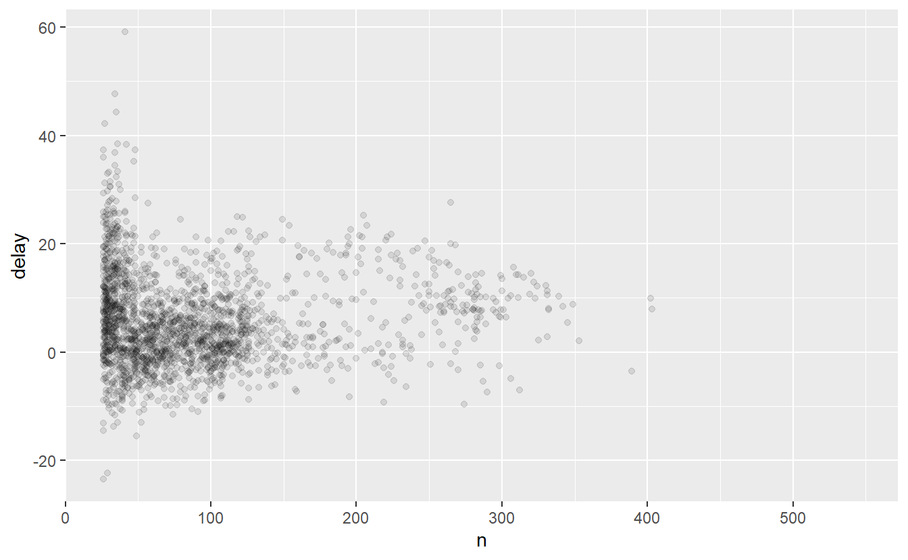
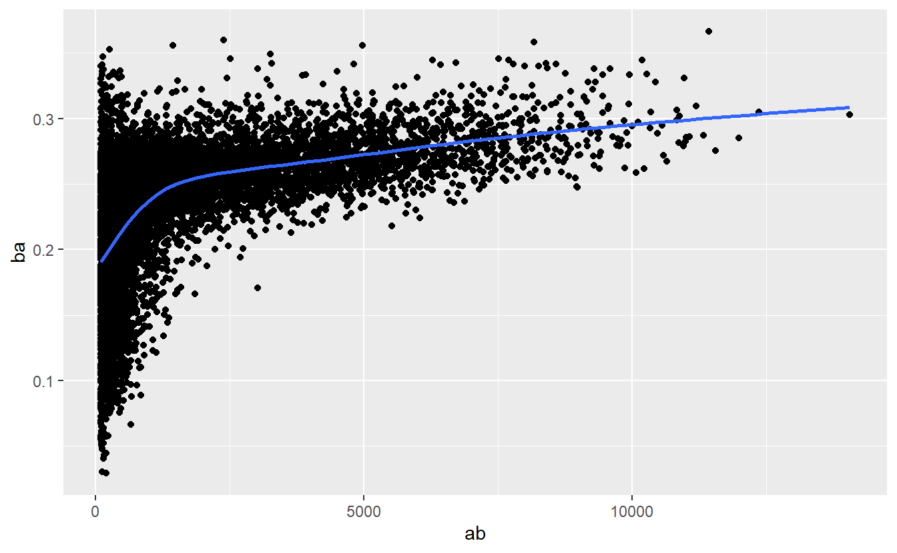

# Data transformation {#data-transform}

::: {.rmdnote}
You are reading the work-in-progress second edition of R for Data Science. This chapter is currently undergoing heavy restructuring and may be confusing or incomplete. You can find the polished first edition at <https://r4ds.had.co.nz>.
:::

## Introduction

Visualisation is an important tool for insight generation, but it is rare that you get the data in exactly the right form you need.
Often you'll need to create some new variables or summaries, or maybe you just want to rename the variables or reorder the observations in order to make the data a little easier to work with.
You'll learn how to do all that (and more!) in this chapter, which will teach you how to transform your data using the dplyr package and a new dataset on flights departing New York City in 2013.

### Prerequisites

In this chapter we're going to focus on how to use the dplyr package, another core member of the tidyverse.
We'll illustrate the key ideas using data from the nycflights13 package, and use ggplot2 to help us understand the data.


```r
library(nycflights13)
library(tidyverse)
#> -- Attaching packages --------------------------------------- tidyverse 1.3.1 --
#> v ggplot2 3.3.5          v purrr   0.3.4     
#> v tibble  3.1.2          v dplyr   1.0.7     
#> v tidyr   1.1.3          v stringr 1.4.0.9000
#> v readr   2.0.1          v forcats 0.5.1
#> -- Conflicts ------------------------------------------ tidyverse_conflicts() --
#> x dplyr::filter() masks stats::filter()
#> x dplyr::lag()    masks stats::lag()
```

Take careful note of the conflicts message that's printed when you load the tidyverse.
It tells you that dplyr overwrites some functions in base R.
If you want to use the base version of these functions after loading dplyr, you'll need to use their full names: `stats::filter()` and `stats::lag()`.

### nycflights13

To explore the basic dplyr verbs, we're going to look at `nycflights13::flights`.
This data frame contains all 336,776 flights that departed from New York City in 2013.
The data comes from the US [Bureau of Transportation Statistics](http://www.transtats.bts.gov/DatabaseInfo.asp?DB_ID=120&Link=0), and is documented in `?flights`.


```r
flights
#> # A tibble: 336,776 x 19
#>    year month   day dep_time sched_dep_time dep_delay arr_time sched_arr_time
#>   <int> <int> <int>    <int>          <int>     <dbl>    <int>          <int>
#> 1  2013     1     1      517            515         2      830            819
#> 2  2013     1     1      533            529         4      850            830
#> 3  2013     1     1      542            540         2      923            850
#> 4  2013     1     1      544            545        -1     1004           1022
#> 5  2013     1     1      554            600        -6      812            837
#> 6  2013     1     1      554            558        -4      740            728
#> # ... with 336,770 more rows, and 11 more variables: arr_delay <dbl>,
#> #   carrier <chr>, flight <int>, tailnum <chr>, origin <chr>, dest <chr>,
#> #   air_time <dbl>, distance <dbl>, hour <dbl>, minute <dbl>, time_hour <dttm>
```

If you've used R before, you might notice that this data frame prints a little differently to data frames you might've worked with in the past.
That's because it's a **tibble**, a special type of data frame designed by the tidyverse team to avoid some common data.frame gotchas.
The most important difference is the way it prints: tibbles are designed for large datasets, so only show the first few rows and only the columns that fit on one screen.
If you want to see everything you can use `View(flights)` to open the dataset in the RStudio viewer.
We'll come back to other important differences in Chapter \@ref(tibbles).

You might also have noticed the row of short abbreviations under the column names.
These describe the type of each variable:

-   `int` stands for integer.

-   `dbl` stands for double, a vector of real numbers.

-   `chr` stands for character, a vector of strings.

-   `dttm` stands for date-time (a date + a time).

There are three other common types that aren't used here but you'll encounter later in the book:

-   `lgl` stands for logical, a vector that contains only `TRUE` or `FALSE`.

-   `fctr` stands for factor, which R uses to represent categorical variables with fixed possible values.

-   `date` stands for date.

### dplyr basics

In this chapter you are going to learn the primary dplyr verbs which will allow you to solve the vast majority of your data manipulation challenges.
They are organised into four camps:

-   Functions that operate on **rows**: `filter()` subsets rows based on the values of the columns, `slice()` and friends subsets rows based on their position, and `arrange()` changes the order of the rows.

-   Functions that operate on **columns**: `mutate()` creates new columns, `select()` columns, `rename()` changes their names, and `relocate()` which changes their positions.

-   Functions that operate on **groups**: `group_by()` divides data up into groups for analysis, and `summarise()` reduces each group to a single row.

Later, in Chapter \@ref(relational-data), you'll learn about other verbs that work with **tables**, like the join functions and the set operations.

All dplyr verbs work the same way:

1.  The first argument is a data frame.

2.  The subsequent arguments describe what to do with the data frame, using the variable names (without quotes).

3.  The result is a new data frame.

Together these properties make it easy to chain together multiple simple steps to achieve a complex result.
Let's dive in and see how these verbs work.

## Rows

These functions affect the rows (the observations), leaving the columns (the variables) unchanged.
`filter()` changes which rows are included without changing the order, `arrange()` changes the order without changing the membership.

### `filter()`

`filter()` allows you to choose rows based on their values[^data-transform-1].
The first argument is the name of the data frame.
The second and subsequent arguments are the expressions that filter the data frame.
For example, we can select all flights on January 1st with:

[^data-transform-1]: Later, you'll learn about the `slice_*()` family which allows you to choose rows based on their positions


```r
filter(flights, month == 1, day == 1)
#> # A tibble: 842 x 19
#>    year month   day dep_time sched_dep_time dep_delay arr_time sched_arr_time
#>   <int> <int> <int>    <int>          <int>     <dbl>    <int>          <int>
#> 1  2013     1     1      517            515         2      830            819
#> 2  2013     1     1      533            529         4      850            830
#> 3  2013     1     1      542            540         2      923            850
#> 4  2013     1     1      544            545        -1     1004           1022
#> 5  2013     1     1      554            600        -6      812            837
#> 6  2013     1     1      554            558        -4      740            728
#> # ... with 836 more rows, and 11 more variables: arr_delay <dbl>,
#> #   carrier <chr>, flight <int>, tailnum <chr>, origin <chr>, dest <chr>,
#> #   air_time <dbl>, distance <dbl>, hour <dbl>, minute <dbl>, time_hour <dttm>
```

When you run that line of code, dplyr executes the filtering operation and returns a new data frame.
dplyr functions never modify their inputs, so if you want to save the result, you'll need to use the assignment operator, `<-`:


```r
jan1 <- filter(flights, month == 1, day == 1)
```

To use filtering effectively, you have to know how to select the observations that you want using the comparison operators.
R provides the standard suite: `>`, `>=`, `<`, `<=`, `!=` (not equal), and `==` (equal).
It also provides `%in%`: `filter(df, x %in% c(a, b, c))` will return all rows where `x` is `a`, `b`, or `c`.

When you're starting out with R, the easiest mistake to make is to use `=` instead of `==` when testing for equality.
`filter()` will let you know when this happens:


```r
filter(flights, month = 1)
#> Error: Problem with `filter()` input `..1`.
#> x Input `..1` is named.
#> i This usually means that you've used `=` instead of `==`.
#> i Did you mean `month == 1`?
```

### `arrange()`

`arrange()` works similarly to `filter()` except that instead of selecting rows, it changes their order.
It takes a data frame and a set of column names (or more complicated expressions) to order by.
If you provide more than one column name, each additional column will be used to break ties in the values of preceding columns:


```r
arrange(flights, year, month, day)
#> # A tibble: 336,776 x 19
#>    year month   day dep_time sched_dep_time dep_delay arr_time sched_arr_time
#>   <int> <int> <int>    <int>          <int>     <dbl>    <int>          <int>
#> 1  2013     1     1      517            515         2      830            819
#> 2  2013     1     1      533            529         4      850            830
#> 3  2013     1     1      542            540         2      923            850
#> 4  2013     1     1      544            545        -1     1004           1022
#> 5  2013     1     1      554            600        -6      812            837
#> 6  2013     1     1      554            558        -4      740            728
#> # ... with 336,770 more rows, and 11 more variables: arr_delay <dbl>,
#> #   carrier <chr>, flight <int>, tailnum <chr>, origin <chr>, dest <chr>,
#> #   air_time <dbl>, distance <dbl>, hour <dbl>, minute <dbl>, time_hour <dttm>
```

You can use `desc()` to re-order by a column in descending order:


```r
arrange(flights, desc(dep_delay))
#> # A tibble: 336,776 x 19
#>    year month   day dep_time sched_dep_time dep_delay arr_time sched_arr_time
#>   <int> <int> <int>    <int>          <int>     <dbl>    <int>          <int>
#> 1  2013     1     9      641            900      1301     1242           1530
#> 2  2013     6    15     1432           1935      1137     1607           2120
#> 3  2013     1    10     1121           1635      1126     1239           1810
#> 4  2013     9    20     1139           1845      1014     1457           2210
#> 5  2013     7    22      845           1600      1005     1044           1815
#> 6  2013     4    10     1100           1900       960     1342           2211
#> # ... with 336,770 more rows, and 11 more variables: arr_delay <dbl>,
#> #   carrier <chr>, flight <int>, tailnum <chr>, origin <chr>, dest <chr>,
#> #   air_time <dbl>, distance <dbl>, hour <dbl>, minute <dbl>, time_hour <dttm>
```

### Exercises

1.  Find all flights that

    a.  Had an arrival delay of two or more hours
    b.  Flew to Houston (`IAH` or `HOU`)
    c.  Were operated by United, American, or Delta
    d.  Departed in summer (July, August, and September)
    e.  Arrived more than two hours late, but didn't leave late
    f.  Were delayed by at least an hour, but made up over 30 minutes in flight
    g.  Departed between midnight and 6am (inclusive)

2.  Sort `flights` to find the flights with longest departure delays.
    Find the flights that left earliest.

3.  Sort `flights` to find the fastest (highest speed) flights.
    (Hint: try sorting by a calculation).

4.  Which flights travelled the farthest?
    Which travelled the shortest?

## Columns

These functions affect the columns (the variables) without changing the rows (the observations).
`mutate()` creates new variables that are functions of the existing variables; `select()`, `rename()`, and `relocate()` changes which variables are present, their names, and their positions.

### `mutate()`

The job of `mutate()` is to add new columns that are functions of existing column.
In the later chapters, you'll learn the full set of functions that you can use to manipulate different types of variables.
For now, we'll stick with basic mathematical operators, which allows us to compute the `gain`, how much time a delayed flight made up in the air, and the `speed` in miles per hour:


```r
mutate(flights,
  gain = dep_delay - arr_delay,
  speed = distance / air_time * 60
)
#> # A tibble: 336,776 x 21
#>    year month   day dep_time sched_dep_time dep_delay arr_time sched_arr_time
#>   <int> <int> <int>    <int>          <int>     <dbl>    <int>          <int>
#> 1  2013     1     1      517            515         2      830            819
#> 2  2013     1     1      533            529         4      850            830
#> 3  2013     1     1      542            540         2      923            850
#> 4  2013     1     1      544            545        -1     1004           1022
#> 5  2013     1     1      554            600        -6      812            837
#> 6  2013     1     1      554            558        -4      740            728
#> # ... with 336,770 more rows, and 13 more variables: arr_delay <dbl>,
#> #   carrier <chr>, flight <int>, tailnum <chr>, origin <chr>, dest <chr>,
#> #   air_time <dbl>, distance <dbl>, hour <dbl>, minute <dbl>, time_hour <dttm>,
#> #   gain <dbl>, speed <dbl>
```

By default, `mutate()` adds new columns at the right hand side of your dataset, which makes it hard to see what's happening here.
We can use the `.before` argument to instead add the variables to the left hand side[^data-transform-2]:

[^data-transform-2]: Remember that when you're in RStudio, the easiest way to see all the columns is `View()`.


```r
mutate(flights,
  gain = dep_delay - arr_delay,
  speed = distance / air_time * 60,
  .before = 1
)
#> # A tibble: 336,776 x 21
#>    gain speed  year month   day dep_time sched_dep_time dep_delay arr_time
#>   <dbl> <dbl> <int> <int> <int>    <int>          <int>     <dbl>    <int>
#> 1    -9  370.  2013     1     1      517            515         2      830
#> 2   -16  374.  2013     1     1      533            529         4      850
#> 3   -31  408.  2013     1     1      542            540         2      923
#> 4    17  517.  2013     1     1      544            545        -1     1004
#> 5    19  394.  2013     1     1      554            600        -6      812
#> 6   -16  288.  2013     1     1      554            558        -4      740
#> # ... with 336,770 more rows, and 12 more variables: sched_arr_time <int>,
#> #   arr_delay <dbl>, carrier <chr>, flight <int>, tailnum <chr>, origin <chr>,
#> #   dest <chr>, air_time <dbl>, distance <dbl>, hour <dbl>, minute <dbl>,
#> #   time_hour <dttm>
```

The leading `.` is a sign that `.before` is an argument to the function, not a new variable being created.
You can also use `.after` to add after a variable, and use a variable name instead of a position:


```r
mutate(flights,
  gain = dep_delay - arr_delay,
  speed = distance / air_time * 60,
  .after = day
)
#> # A tibble: 336,776 x 21
#>    year month   day  gain speed dep_time sched_dep_time dep_delay arr_time
#>   <int> <int> <int> <dbl> <dbl>    <int>          <int>     <dbl>    <int>
#> 1  2013     1     1    -9  370.      517            515         2      830
#> 2  2013     1     1   -16  374.      533            529         4      850
#> 3  2013     1     1   -31  408.      542            540         2      923
#> 4  2013     1     1    17  517.      544            545        -1     1004
#> 5  2013     1     1    19  394.      554            600        -6      812
#> 6  2013     1     1   -16  288.      554            558        -4      740
#> # ... with 336,770 more rows, and 12 more variables: sched_arr_time <int>,
#> #   arr_delay <dbl>, carrier <chr>, flight <int>, tailnum <chr>, origin <chr>,
#> #   dest <chr>, air_time <dbl>, distance <dbl>, hour <dbl>, minute <dbl>,
#> #   time_hour <dttm>
```

Alternatively, can control which variables are kept with the `.keep` argument:


```r
mutate(flights,
  gain = dep_delay - arr_delay,
  hours = air_time / 60,
  gain_per_hour = gain / hours,
  .keep = "none"
)
#> # A tibble: 336,776 x 3
#>    gain hours gain_per_hour
#>   <dbl> <dbl>         <dbl>
#> 1    -9  3.78         -2.38
#> 2   -16  3.78         -4.23
#> 3   -31  2.67        -11.6 
#> 4    17  3.05          5.57
#> 5    19  1.93          9.83
#> 6   -16  2.5          -6.4 
#> # ... with 336,770 more rows
```

### `select()` {#select}

It's not uncommon to get datasets with hundreds or even thousands of variables.
In this case, the first challenge is often narrowing in on the variables you're actually interested in.
`select()` allows you to rapidly zoom in on a useful subset using operations based on the names of the variables.

`select()` is not terribly useful with the flights data because we only have 19 variables, but you can still get the general idea of how it works:


```r
# Select columns by name
select(flights, year, month, day)
#> # A tibble: 336,776 x 3
#>    year month   day
#>   <int> <int> <int>
#> 1  2013     1     1
#> 2  2013     1     1
#> 3  2013     1     1
#> 4  2013     1     1
#> 5  2013     1     1
#> 6  2013     1     1
#> # ... with 336,770 more rows

# Select all columns between year and day (inclusive)
select(flights, year:day)
#> # A tibble: 336,776 x 3
#>    year month   day
#>   <int> <int> <int>
#> 1  2013     1     1
#> 2  2013     1     1
#> 3  2013     1     1
#> 4  2013     1     1
#> 5  2013     1     1
#> 6  2013     1     1
#> # ... with 336,770 more rows

# Select all columns except those from year to day (inclusive)
select(flights, -(year:day))
#> # A tibble: 336,776 x 16
#>   dep_time sched_dep_time dep_delay arr_time sched_arr_time arr_delay carrier
#>      <int>          <int>     <dbl>    <int>          <int>     <dbl> <chr>  
#> 1      517            515         2      830            819        11 UA     
#> 2      533            529         4      850            830        20 UA     
#> 3      542            540         2      923            850        33 AA     
#> 4      544            545        -1     1004           1022       -18 B6     
#> 5      554            600        -6      812            837       -25 DL     
#> 6      554            558        -4      740            728        12 UA     
#> # ... with 336,770 more rows, and 9 more variables: flight <int>,
#> #   tailnum <chr>, origin <chr>, dest <chr>, air_time <dbl>, distance <dbl>,
#> #   hour <dbl>, minute <dbl>, time_hour <dttm>
```

There are a number of helper functions you can use within `select()`:

-   `starts_with("abc")`: matches names that begin with "abc".

-   `ends_with("xyz")`: matches names that end with "xyz".

-   `contains("ijk")`: matches names that contain "ijk".

-   `num_range("x", 1:3)`: matches `x1`, `x2` and `x3`.

See `?select` for more details.
Once you know regular expressions (the topic of Chapter \@ref(regular-expressions)) you'll also be use `matches()` to select variables that match a regexp.

You can rename variables as you `select()` them by using `=`.
The new name appears on the left hand side of the `=`, and the old variable appears on the right hand side:


```r
select(flights, tail_num = tailnum)
#> # A tibble: 336,776 x 1
#>   tail_num
#>   <chr>   
#> 1 N14228  
#> 2 N24211  
#> 3 N619AA  
#> 4 N804JB  
#> 5 N668DN  
#> 6 N39463  
#> # ... with 336,770 more rows
```

### `rename()`

If you just want to keep all the existing variables and just want to rename a few, you can use `rename()` instead of `select()`:


```r
rename(flights, tail_num = tailnum)
#> # A tibble: 336,776 x 19
#>    year month   day dep_time sched_dep_time dep_delay arr_time sched_arr_time
#>   <int> <int> <int>    <int>          <int>     <dbl>    <int>          <int>
#> 1  2013     1     1      517            515         2      830            819
#> 2  2013     1     1      533            529         4      850            830
#> 3  2013     1     1      542            540         2      923            850
#> 4  2013     1     1      544            545        -1     1004           1022
#> 5  2013     1     1      554            600        -6      812            837
#> 6  2013     1     1      554            558        -4      740            728
#> # ... with 336,770 more rows, and 11 more variables: arr_delay <dbl>,
#> #   carrier <chr>, flight <int>, tail_num <chr>, origin <chr>, dest <chr>,
#> #   air_time <dbl>, distance <dbl>, hour <dbl>, minute <dbl>, time_hour <dttm>
```

It works exactly the same way as `select()`, but keeps all the variables that aren't explicitly selected.

### `relocate()`

You can move variables around with `relocate`.
By default it moves variables to the front:


```r
relocate(flights, time_hour, air_time)
#> # A tibble: 336,776 x 19
#>   time_hour           air_time  year month   day dep_time sched_dep_time
#>   <dttm>                 <dbl> <int> <int> <int>    <int>          <int>
#> 1 2013-01-01 05:00:00      227  2013     1     1      517            515
#> 2 2013-01-01 05:00:00      227  2013     1     1      533            529
#> 3 2013-01-01 05:00:00      160  2013     1     1      542            540
#> 4 2013-01-01 05:00:00      183  2013     1     1      544            545
#> 5 2013-01-01 06:00:00      116  2013     1     1      554            600
#> 6 2013-01-01 05:00:00      150  2013     1     1      554            558
#> # ... with 336,770 more rows, and 12 more variables: dep_delay <dbl>,
#> #   arr_time <int>, sched_arr_time <int>, arr_delay <dbl>, carrier <chr>,
#> #   flight <int>, tailnum <chr>, origin <chr>, dest <chr>, distance <dbl>,
#> #   hour <dbl>, minute <dbl>
```

But you can use the `.before` and `.after` arguments to choose where to place them:


```r
relocate(flights, year:dep_time, .after = time_hour)
#> # A tibble: 336,776 x 19
#>   sched_dep_time dep_delay arr_time sched_arr_time arr_delay carrier flight
#>            <int>     <dbl>    <int>          <int>     <dbl> <chr>    <int>
#> 1            515         2      830            819        11 UA        1545
#> 2            529         4      850            830        20 UA        1714
#> 3            540         2      923            850        33 AA        1141
#> 4            545        -1     1004           1022       -18 B6         725
#> 5            600        -6      812            837       -25 DL         461
#> 6            558        -4      740            728        12 UA        1696
#> # ... with 336,770 more rows, and 12 more variables: tailnum <chr>,
#> #   origin <chr>, dest <chr>, air_time <dbl>, distance <dbl>, hour <dbl>,
#> #   minute <dbl>, time_hour <dttm>, year <int>, month <int>, day <int>,
#> #   dep_time <int>
relocate(flights, starts_with("arr"), .before = dep_time)
#> # A tibble: 336,776 x 19
#>    year month   day arr_time arr_delay dep_time sched_dep_time dep_delay
#>   <int> <int> <int>    <int>     <dbl>    <int>          <int>     <dbl>
#> 1  2013     1     1      830        11      517            515         2
#> 2  2013     1     1      850        20      533            529         4
#> 3  2013     1     1      923        33      542            540         2
#> 4  2013     1     1     1004       -18      544            545        -1
#> 5  2013     1     1      812       -25      554            600        -6
#> 6  2013     1     1      740        12      554            558        -4
#> # ... with 336,770 more rows, and 11 more variables: sched_arr_time <int>,
#> #   carrier <chr>, flight <int>, tailnum <chr>, origin <chr>, dest <chr>,
#> #   air_time <dbl>, distance <dbl>, hour <dbl>, minute <dbl>, time_hour <dttm>
```

These work the same way as the `.before` and `.after` arguments to `mutate()` --- they can be a numeric position, the name of a variable, or any of the other functions that you can use with `select()`.

### Exercises


1.  Currently `dep_time` and `sched_dep_time` are convenient to look at, but hard to compute with because they're not really continuous numbers.
    Convert them to a more convenient representation of number of minutes since midnight.

2.  Compare `air_time` with `arr_time - dep_time`.
    What do you expect to see?
    What do you see?
    What do you need to do to fix it?

3.  Compare `dep_time`, `sched_dep_time`, and `dep_delay`.
    How would you expect those three numbers to be related?

4.  Brainstorm as many ways as possible to select `dep_time`, `dep_delay`, `arr_time`, and `arr_delay` from `flights`.

5.  What happens if you include the name of a variable multiple times in a `select()` call?

6.  What does the `any_of()` function do?
    Why might it be helpful in conjunction with this vector?

    
    ```r
    variables <- c("year", "month", "day", "dep_delay", "arr_delay")
    ```

7.  Does the result of running the following code surprise you?
    How do the select helpers deal with case by default?
    How can you change that default?

    
    ```r
    select(flights, contains("TIME"))
    ```

## Groups

The real power of dplyr comes when you add grouping into the mix.
The two key functions are `group_by()` and `summarise()`, but as you'll learn `group_by()` affects many other dplyr verbs in interesting ways.

### `group_by()`

Use `group_by()` to divide your dataset into groups meaningful for your analysis:


```r
by_month <- group_by(flights, month)
by_month
#> # A tibble: 336,776 x 19
#> # Groups:   month [12]
#>    year month   day dep_time sched_dep_time dep_delay arr_time sched_arr_time
#>   <int> <int> <int>    <int>          <int>     <dbl>    <int>          <int>
#> 1  2013     1     1      517            515         2      830            819
#> 2  2013     1     1      533            529         4      850            830
#> 3  2013     1     1      542            540         2      923            850
#> 4  2013     1     1      544            545        -1     1004           1022
#> 5  2013     1     1      554            600        -6      812            837
#> 6  2013     1     1      554            558        -4      740            728
#> # ... with 336,770 more rows, and 11 more variables: arr_delay <dbl>,
#> #   carrier <chr>, flight <int>, tailnum <chr>, origin <chr>, dest <chr>,
#> #   air_time <dbl>, distance <dbl>, hour <dbl>, minute <dbl>, time_hour <dttm>
```

`group_by()` doesn't change the data but, if you look closely, you'll notice that it's now "grouped by" month.
The reason to group your data is because it changes the operation of subsequent verbs.

### `summarise()`

The most important operation that you might apply to grouped data is a summary.
It collapses each group to a single row[^data-transform-3].
Here we compute the average departure delay by month:

[^data-transform-3]: This is a slightly simplification; later on you'll learn how to use `summarise()` to produce multiple summary rows for each group.


```r
summarise(by_month, delay = mean(dep_delay, na.rm = TRUE))
#> # A tibble: 12 x 2
#>   month delay
#>   <int> <dbl>
#> 1     1  10.0
#> 2     2  10.8
#> 3     3  13.2
#> 4     4  13.9
#> 5     5  13.0
#> 6     6  20.8
#> # ... with 6 more rows
```

You can create any number of summaries in a single call to `summarise()`.
You'll learn various useful summaries in the upcoming chapters on individual data types, but one very useful summary is `n()`, which returns the number of rows in each group:


```r
summarise(by_month, delay = mean(dep_delay, na.rm = TRUE), n = n())
#> # A tibble: 12 x 3
#>   month delay     n
#>   <int> <dbl> <int>
#> 1     1  10.0 27004
#> 2     2  10.8 24951
#> 3     3  13.2 28834
#> 4     4  13.9 28330
#> 5     5  13.0 28796
#> 6     6  20.8 28243
#> # ... with 6 more rows
```

(In fact, `count()`, which we've used a bunch in previous chapters, is just shorthand for `group_by()` + `summarise(n = n())`.)

We'll come back to discuss missing values in Chapter \@ref(missing-values).
For now, know you can drop them in summary functions by using `na.rm = TRUE` or remove them with a filter by using `!is.na()`:


```r
not_cancelled <- filter(flights, !is.na(dep_delay))
by_month <- group_by(not_cancelled, month)
summarise(by_month, delay = mean(dep_delay))
#> # A tibble: 12 x 2
#>   month delay
#>   <int> <dbl>
#> 1     1  10.0
#> 2     2  10.8
#> 3     3  13.2
#> 4     4  13.9
#> 5     5  13.0
#> 6     6  20.8
#> # ... with 6 more rows
```

### Combining multiple operations

This code is starting to get a little frustrating to write because each intermediate data frame has to be given a name, even though we don't care about them.
Naming things is hard, so this slows down our analysis.
There's another way to tackle the same problem with the **pipe**, `%>%`:


```r
flights %>% 
  filter(!is.na(dep_delay)) %>% 
  group_by(month) %>%
  summarise(delay = mean(dep_delay), n = n())
#> # A tibble: 12 x 3
#>   month delay     n
#>   <int> <dbl> <int>
#> 1     1  10.0 26483
#> 2     2  10.8 23690
#> 3     3  13.2 27973
#> 4     4  13.9 27662
#> 5     5  13.0 28233
#> 6     6  20.8 27234
#> # ... with 6 more rows
```

When you see `%>%` in code, a good way to "pronounce" it in your head is as "then".
That way you can read this code as a series of imperative statements: take the flights dataset, then filter it to remove rows with missing `dep_delay`, then group it by month, then summarise it with the average `dep_delay` and the number of observations.

Behind the scenes, `x %>% f(y)` turns into `f(x, y)`, and `x %>% f(y) %>% g(z)` turns into `g(f(x, y), z)` and so on.
You can use the pipe to rewrite multiple operations in a way that you can read left-to-right, top-to-bottom.
We'll use piping frequently from now on because it considerably improves the readability of code, and we'll come back to it in more detail in Chapter \@ref(workflow-pipes).

### Grouping by multiple variables

You can group a data frame by multiple variables:


```r
daily <- flights %>% group_by(year, month, day)
daily
#> # A tibble: 336,776 x 19
#> # Groups:   year, month, day [365]
#>    year month   day dep_time sched_dep_time dep_delay arr_time sched_arr_time
#>   <int> <int> <int>    <int>          <int>     <dbl>    <int>          <int>
#> 1  2013     1     1      517            515         2      830            819
#> 2  2013     1     1      533            529         4      850            830
#> 3  2013     1     1      542            540         2      923            850
#> 4  2013     1     1      544            545        -1     1004           1022
#> 5  2013     1     1      554            600        -6      812            837
#> 6  2013     1     1      554            558        -4      740            728
#> # ... with 336,770 more rows, and 11 more variables: arr_delay <dbl>,
#> #   carrier <chr>, flight <int>, tailnum <chr>, origin <chr>, dest <chr>,
#> #   air_time <dbl>, distance <dbl>, hour <dbl>, minute <dbl>, time_hour <dttm>
```

When you group by multiple variables, each summary peels off one level of the grouping by default, and a message is printed that tells you how you can change this behaviour.


```r
daily %>% summarise(n = n())
#> `summarise()` has grouped output by 'year', 'month'. You can override using the `.groups` argument.
#> # A tibble: 365 x 4
#> # Groups:   year, month [12]
#>    year month   day     n
#>   <int> <int> <int> <int>
#> 1  2013     1     1   842
#> 2  2013     1     2   943
#> 3  2013     1     3   914
#> 4  2013     1     4   915
#> 5  2013     1     5   720
#> 6  2013     1     6   832
#> # ... with 359 more rows
```

If you're happy with this behaviour, you can explicitly define it in order to suppress the message:


```r
daily %>% summarise(n = n(), .groups = "drop_last")
```

Alternatively, you can change the default behaviour by setting a different value, e.g. `"drop"` for dropping all levels of grouping or `"keep"` for same grouping structure as `daily`:


```r
daily %>% summarise(n = n(), .groups = "drop")
daily %>% summarise(n = n(), .groups = "keep")
```

### Ungrouping

You might also want to remove grouping outside of `summarise()`.
You can do this and return to operations on ungrouped data using `ungroup()`.


```r
daily %>% 
  ungroup() %>%
  summarise(
    delay = mean(dep_delay, na.rm = TRUE), 
    flights = n()
  )
#> # A tibble: 1 x 2
#>   delay flights
#>   <dbl>   <int>
#> 1  12.6  336776
```

For the purposes of summarising, ungrouped data is treated as if all your data was in a single group, so you get one row back.

### Selecting rows

`arrange()` and `filter()` are mostly unaffected by grouping.
But the slice functions are super useful:

-   `slice_head()` and `slice_tail()` select the first or last rows in each group.

-   `slice_max()` and `slice_min()` select the rows in each group with highest or lowest values.

-   `slice_sample()` random selects rows from each group.

Each of these verbs takes either a `n` or `prop` argument depending on whether you want to select a fixed number of rows, or a number of rows proportional to the group size.

### Other verbs

-   `select()`, `rename()`, `relocate()`: grouping has no affect

-   `filter()`, `mutate()`: computation happens per group.
    This doesn't affect the functions you currently know but is very useful once you learn about window functions, Section \@ref(window-functions).

### Exercises

1.  Which carrier has the worst delays?
    Challenge: can you disentangle the effects of bad airports vs. bad carriers?
    Why/why not?
    (Hint: think about `flights %>% group_by(carrier, dest) %>% summarise(n())`)

2.  What does the `sort` argument to `count()` do.
    Can you explain it in terms of the dplyr verbs you've learned so far?

## Case study: aggregates and sample size

Whenever you do any aggregation, it's always a good idea to include either a count (`n()`), or a count of non-missing values (`sum(!is.na(x))`).
That way you can check that you're not drawing conclusions based on very small amounts of data.
For example, let's look at the planes (identified by their tail number) that have the highest average delays:


```r
delays <- not_cancelled %>% 
  group_by(tailnum) %>% 
  summarise(
    delay = mean(arr_delay)
  )

ggplot(data = delays, mapping = aes(x = delay)) + 
  geom_freqpoly(binwidth = 10)
#> Warning: Removed 874 rows containing non-finite values (stat_bin).
```


Wow, there are some planes that have an *average* delay of 5 hours (300 minutes)!

The story is actually a little more nuanced.
We can get more insight if we draw a scatterplot of number of flights vs. average delay:


```r
delays <- not_cancelled %>% 
  group_by(tailnum) %>% 
  summarise(
    delay = mean(arr_delay),
    n = n()
  )

ggplot(data = delays, mapping = aes(x = n, y = delay)) + 
  geom_point(alpha = 1/10)
#> Warning: Removed 874 rows containing missing values (geom_point).
```


Not surprisingly, there is much greater variation in the average delay when there are few flights.
The shape of this plot is very characteristic: whenever you plot a mean (or other summary) vs. group size, you'll see that the variation decreases as the sample size increases.

When looking at this sort of plot, it's often useful to filter out the groups with the smallest numbers of observations, so you can see more of the pattern and less of the extreme variation in the smallest groups.
This is what the following code does, as well as showing you a handy pattern for integrating ggplot2 into dplyr flows.
It's a bit painful that you have to switch from `%>%` to `+`, but once you get the hang of it, it's quite convenient.


```r
delays %>% 
  filter(n > 25) %>% 
  ggplot(mapping = aes(x = n, y = delay)) + 
  geom_point(alpha = 1/10)
#> Warning: Removed 828 rows containing missing values (geom_point).
```



There's another common variation of this type of pattern.
Let's look at how the average performance of batters in baseball is related to the number of times they're at bat.
Here I use data from the **Lahman** package to compute the batting average (number of hits / number of attempts) of every major league baseball player.

When I plot the skill of the batter (measured by the batting average, `ba`) against the number of opportunities to hit the ball (measured by at bat, `ab`), you see two patterns:

1.  As above, the variation in our aggregate decreases as we get more data points.

2.  There's a positive correlation between skill (`ba`) and opportunities to hit the ball (`ab`).
    This is because teams control who gets to play, and obviously they'll pick their best players.


```r
# Convert to a tibble so it prints nicely
batting <- as_tibble(Lahman::Batting)

batters <- batting %>% 
  group_by(playerID) %>% 
  summarise(
    ba = sum(H, na.rm = TRUE) / sum(AB, na.rm = TRUE),
    ab = sum(AB, na.rm = TRUE)
  )

batters %>% 
  filter(ab > 100) %>% 
  ggplot(mapping = aes(x = ab, y = ba)) +
    geom_point() + 
    geom_smooth(se = FALSE)
#> `geom_smooth()` using method = 'gam' and formula 'y ~ s(x, bs = "cs")'
```



This also has important implications for ranking.
If you naively sort on `desc(ba)`, the people with the best batting averages are clearly lucky, not skilled:


```r
batters %>% 
  arrange(desc(ba))
#> # A tibble: 19,898 x 3
#>   playerID     ba    ab
#>   <chr>     <dbl> <int>
#> 1 abramge01     1     1
#> 2 alanirj01     1     1
#> 3 alberan01     1     1
#> 4 banisje01     1     1
#> 5 bartocl01     1     1
#> 6 bassdo01      1     1
#> # ... with 19,892 more rows
```

You can find a good explanation of this problem at <http://varianceexplained.org/r/empirical_bayes_baseball/> and <http://www.evanmiller.org/how-not-to-sort-by-average-rating.html>.
